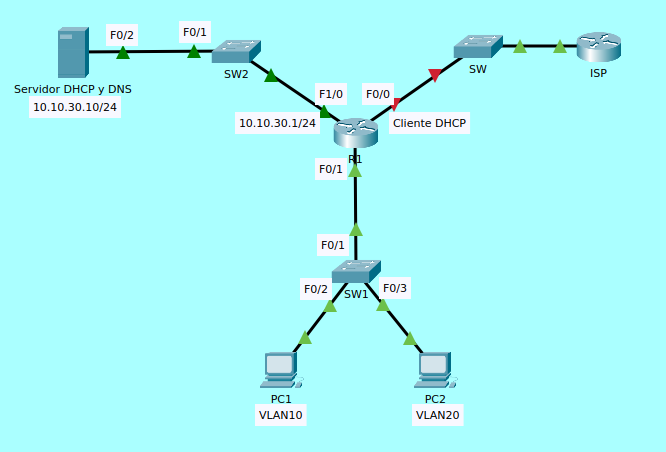

# Servidor DHCP en redes Cisco

## 1. ¿Qué es un servidor DHCP?
El servidor DHCP es el encargado de asignar dinámicamente direcciones IP y otros parámetros de configuración a los dispositivos de la red.

### Ventajas:
- Automatiza la configuración → menos trabajo manual.
- Reduce errores humanos.
- Permite reuso eficiente de direcciones IP.

### Funcionamiento del protocolo DHCP

#### El proceso básico se resume en DORA:
1. **Discover** → El cliente busca un servidor DHCP.
2. **Offer** → El servidor ofrece una dirección IP.
3. **Request** → El cliente solicita formalmente la IP.
4. **Acknowledge** → El servidor confirma la asignación.

## 2. Configurar un router Cisco como servidor DHCP

### Pasos básicos
 1. Definir el pool DHCP (conjunto de direcciones).
 2. Configurar parámetros de red (puerta de enlace, DNS, etc.).
 3. Excluir direcciones que no deben asignarse dinámicamente.

### Ejemplo práctico
 Supongamos una red con VLAN 10 para usuarios:
- Red: 192.168.10.0/24
- Puerta de enlace: 192.168.10.1
- DNS: 8.8.8.8
- IPs a excluir: 192.168.10.1 – 192.168.10.10

```
! Excluir direcciones que no se asignarán (usadas por servidores, gateway, etc.)
ip dhcp excluded-address 192.168.10.1 192.168.10.10

! Crear pool DHCP
ip dhcp pool USUARIOS
 network 192.168.10.0 255.255.255.0
 default-router 192.168.10.1
 dns-server 8.8.8.8
 lease 7
```

### Verificación
- show ip dhcp binding → muestra las IPs entregadas.
- show ip dhcp pool → muestra estadísticas del pool.
- debug ip dhcp server events → modo depuración de asignaciones.

## 3. DHCP Relay Agent
En muchos casos, el servidor DHCP no se encuentra en la misma subred que los clientes. Como el tráfico DHCP se basa en broadcasts, estos no atraviesan routers. El agente DHCP Relay permite reenviar esas solicitudes a un servidor DHCP remoto.

### Configuración
Se usa el comando ```ip helper-address``` en la interfaz del router conectada a la subred del cliente:
```
interface vlan 20
 ip address 192.168.20.1 255.255.255.0
 ip helper-address 192.168.100.10
```
- 192.168.20.1: puerta de enlace de los clientes VLAN 20.
- 192.168.100.10: dirección del servidor DHCP remoto.

### Funcionamiento
 1. El cliente de VLAN 20 envía un DHCP Discover (broadcast).
 2. El router lo recibe y lo reenvía como unicast al servidor 192.168.100.10.
 3. El servidor responde, y el router lo reenvía al cliente.


## 4. Conceptos adicionales importantes

### Reservas DHCP
Es posible asignar siempre la misma IP a un cliente en función de su MAC address.

#### Ejemplo:
```
ip dhcp pool IMPRESORA
 host 192.168.10.50 255.255.255.0
 client-identifier 0100.50ba.abcd.ef
 default-router 192.168.10.1
```
- ```client-identifier``` corresponde a la dirección MAC del dispositivo (en formato hexadecimal).

#### Excluir múltiples rangos
Si se necesita reservar varias IPs para servidores:
```
ip dhcp excluded-address 192.168.10.1 192.168.10.20
ip dhcp excluded-address 192.168.10.200 192.168.10.254
```

#### Comandos de troubleshooting
- ping → verificar conectividad con el cliente o servidor.
- show running-config → verificar configuración DHCP.
- debug ip dhcp server events → observar en tiempo real el proceso DORA.

# Laboratorio



1. Configurar la interfaz F0/0 de R1 como cliente DHCP. Verificar que se recibió IP (El servidor DHCP en el IPS ya fue configurado).
2. Configurar sub-interfaces para las VLANs 10 y 20 en F1/0 de R1, asignarles las IPs 10.10.10.254/24 y 10.10.20.254/24, respectivamente.
3. Configurar un servidor DHCP para la VLAN 10, con servidor DNS en 10.10.30.10.
4. Configurar un agente DHCP Relay para la VLAN 20, con servidor DHCP en 10.10.30.10 (El servidor ya fue configurado).
5. Configurar las VLANs, puertos de acceso y puerto troncal en SW1.
6. Verificar que las PCs reciban IPs y testear conectividad entre ellas.

## Resolución del laboratorio

### 1. Cliente DHCP
```
R1>enable
R1#configure terminal 
R1(config)#interface fastEthernet 0/0
R1(config-if)#ip address dhcp 
R1(config-if)#no shutdown
R1(config)#exit
R1(config)#do show ip interface brief
Interface 		    IP-Address 		OK? 	Method 	Status 	Protocol 
FastEthernet0/0 	203.0.113.2 	YES 	DHCP 		up 		up 
```

### 2. **Sub-interfaces VLANs 10 y 20**
```
R1(config)#interface fastEthernet 0/1
R1(config-if)#no ip address 
R1(config-if)#no shutdown 
R1(config-if)#exit
R1(config)#interface fastEthernet 0/1.10
R1(config-subif)#encapsulation dot1Q 10
R1(config-subif)#ip address 10.10.10.254 255.255.255.0
R1(config-subif)#exit
R1(config)#interface fastEthernet 0/1.20
R1(config-subif)#encapsulation dot1Q 20
R1(config-subif)#ip address 10.10.20.254 255.255.255.0
R1(config-subif)#exit
```

### 3. **Servidor DHCP para VLAN 10**
```
R1(config)#ip dhcp excluded-address 10.10.10.250 10.10.10.254
R1(config)#ip dhcp pool VLAN10
R1(dhcp-config)#network 10.10.10.0 255.255.255.0
R1(dhcp-config)#default-router 10.10.10.254
R1(dhcp-config)#dns-server 10.10.30.10
R1(dhcp-config)#exit
```

### 4. **Agente DHCP Relay para VLAN 20**
```
R1(config)#interface fastEthernet 0/1.20
R1(config-subif)#ip helper-address 10.10.30.10
R1(config-subif)#exit
```

### 5. **Configuración de SW1**
```
SW1#configure terminal
SW1(config)#vlan 10
SW1(config-vlan)#exit
SW1(config)#vlan 20
SW1(config-vlan)#exit
SW1(config)#interface fastEthernet 0/2
SW1(config-if)#switchport mode access 
SW1(config-if)#switchport access vlan 10
SW1(config-if)#exit
SW1(config)#interface fastEthernet 0/3
SW1(config-if)#switchport mode access 
SW1(config-if)#switchport access vlan 20
SW1(config-if)#exit
SW1(config)#interface fastEthernet 0/1
SW1(config-if)#switchport mode trunk 
SW1(config-if)#exit
```

### 6. Verificación de IPs y conectividad

**PC1:**
```
PC1:\>ipconfig /release
IP Address......................: 0.0.0.0
Subnet Mask.....................: 0.0.0.0
Default Gateway.................: 0.0.0.0
DNS Server......................: 0.0.0.0

PC1:\>ipconfig /renew
IP Address......................: 10.10.10.1
Subnet Mask.....................: 255.255.255.0
Default Gateway.................: 10.10.10.254
DNS Server......................: 10.10.30.10
```

**PC2:**
```
PC2:\>ipconfig /release
IP Address......................: 0.0.0.0
Subnet Mask.....................: 0.0.0.0
Default Gateway.................: 0.0.0.0
DNS Server......................: 0.0.0.0

PC2:\>ipconfig /renew
IP Address......................: 10.10.20.1
Subnet Mask.....................: 255.255.255.0
Default Gateway.................: 10.10.20.254
DNS Server......................: 10.10.30.10

PC2:\>ping 10.10.10.1

Pinging 10.10.10.1 with 32 bytes of data:
Reply from 10.10.10.1: bytes=32 time<1ms TTL=127
Reply from 10.10.10.1: bytes=32 time=1ms TTL=127
Reply from 10.10.10.1: bytes=32 time<1ms TTL=127
Reply from 10.10.10.1: bytes=32 time<1ms TTL=127

Ping statistics for 10.10.10.1:
	Packets: Sent = 4, Received = 4, Lost = 0 (0% loss),
Approximate round trip times in milli-seconds:
	Minimum = 0ms, Maximum = 1ms, Average = 0ms
```

**R1:**
```
R1#show ip dhcp binding 
IP address		Client-ID/		    Lease expiration		Type
			    Hardware address
10.10.10.1 		0000.0CA0.A359	    --				        Automatic
R1#show ip dhcp pool 

Pool VLAN10 :
  Utilization mark (high/low)		: 100 / 0
  Subnet size (first/next)		    : 0 / 0 
  Total addresses				    : 254
  Leased addresses			        : 1
  Excluded addresses 			    : 1
  Pending event 				    : none

  1 subnet is currently in the pool
  Current index		IP address range			Leased/Excluded/Total
  10.10.10.1		10.10.10.1 - 10.10.10.254 	1 / 1 / 254
```

## Conclusión
El DHCP es un servicio esencial en cualquier red moderna, ya que automatiza la asignación de direcciones IP y parámetros de red. En entornos Cisco, un router o switch multicapa puede cumplir el rol de servidor DHCP, eliminando la necesidad de configurar cada host manualmente. Cuando el servidor DHCP no está en la misma subred que los clientes, se utiliza un agente DHCP Relay para garantizar que las solicitudes lleguen correctamente.

### Como administradores de red, debemos:
- Planificar bien los rangos de direcciones.
- Excluir direcciones críticas (gateways, servidores).
- Usar reservas cuando sea necesario.
- Documentar y monitorear continuamente las asignaciones.

Un DHCP bien configurado asegura una red eficiente, ordenada y escalable, reduciendo errores humanos y facilitando la administración profesional.
