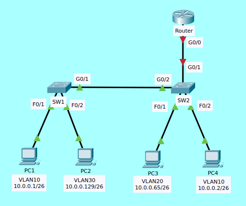

# VLANs en Redes Cisco

## Concepto de VLAN
- Definición: Una VLAN es una red lógica creada sobre la infraestructura de switches.
- Dominio de broadcast: Cada VLAN es un dominio independiente; un broadcast en una VLAN no se propaga a las demás.
- Identificación: Cada VLAN se identifica con un número (VLAN ID, 1–4094).
- Ejemplo: VLAN 10 = Ventas, VLAN 20 = Finanzas, VLAN 30 = IT.

## Beneficios
- Aislamiento de tráfico → mayor seguridad.
- Broadcast limitado → menor congestión.
- Flexibilidad → usuarios en distintas áreas físicas pueden estar en la misma VLAN.

## VLAN por defecto vs. VLAN nativa

### VLAN por defecto
- En switches Cisco, la VLAN 1 es la VLAN por defecto.
- Todos los puertos, por defecto, pertenecen a VLAN 1.
- No es recomendable usarla para usuarios ni para administración, porque es objetivo común en ataques.

### VLAN nativa
- Es la VLAN que no lleva etiqueta (untagged) en un enlace troncal 802.1Q.
- Por defecto, la VLAN nativa también es la VLAN 1, pero se recomienda cambiarla a otra VLAN por seguridad.
- Importante: la VLAN nativa debe coincidir en ambos extremos del troncal, de lo contrario se generan inconsistencias (mismatched native VLAN).

## Puertos de acceso y puertos troncales

### Puertos de acceso (Access ports)
- Conectan dispositivos finales (PCs, impresoras, teléfonos IP).
- Transportan una sola VLAN.
- Configuración típica:
    ```
	interface fastEthernet 0/1
 	 switchport mode access
 	 switchport access vlan 10
    ```

### Puertos troncales (Trunk ports)
- Conectan switches entre sí (o hacia routers/switches multicapa).
- Transportan múltiples VLANs en el mismo enlace.
- Encapsulación: 802.1Q (estándar).
- Configuración típica:
    ```
	interface gigabitEthernet 0/1
 	 switchport trunk encapsulation dot1q
 	 switchport mode trunk
	 switchport trunk native vlan 99
	 switchport trunk allowed vlan 10,20,30,99
    ```
- Allowed VLAN: define qué VLANs viajan por el troncal (mejora la seguridad).

## Comunicación entre VLANs (Inter-VLAN Routing)
Las VLANs son redes lógicas diferentes, por lo tanto necesitan un dispositivo de capa 3 para comunicarse.

### Switch Multicapa (Layer 3 Switch)
- Permite hacer routing interno entre VLANs mediante SVIs (Switch Virtual Interfaces).
- Cada VLAN tiene su propia interfaz VLAN con una IP que actúa como puerta de enlace para los hosts.
- Ejemplo:
    ```
    ! Activar routing en el switch
    ip routing

    ! VLAN 10 (Ventas)
    interface vlan 10
    ip address 192.168.10.1 255.255.255.0
    no shutdown

    ! VLAN 20 (Finanzas)
    interface vlan 20
    ip address 192.168.20.1 255.255.255.0
    no shutdown
    ! VLAN 30 (IT)
    interface vlan 30
    ip address 192.168.30.1 255.255.255.0
    no shutdown
    ```
- Los hosts de cada VLAN usan como gateway la IP configurada en su respectiva interfaz VLAN.
- El switch enruta el tráfico internamente.

## Router-on-a-Stick (Router con subinterfaces)
- Usado cuando no hay switch multicapa.
- El router se conecta al switch mediante un puerto troncal.
- Se crean subinterfaces en la interfaz física del router, una por cada VLAN.
- Ejemplo:
    ```
    interface gigabitEthernet 0/0
    no shutdown

    ! VLAN 10
    interface gigabitEthernet 0/0.10
    encapsulation dot1Q 10
    ip address 192.168.10.1 255.255.255.0

    ! VLAN 20
    interface gigabitEthernet 0/0.20
    encapsulation dot1Q 20
    ip address 192.168.20.1 255.255.255.0

    ! VLAN 30
    interface gigabitEthernet 0/0.30
    encapsulation dot1Q 30
    ip address 192.168.30.1 255.255.255.0
    ```
- El switch se configura con un puerto troncal hacia el router.
- El router hace el enrutamiento entre VLANs.

## Buenas prácticas
- No usar la VLAN 1 ni como VLAN de usuarios ni como VLAN nativa.
- Crear una VLAN dedicada para administración (ejemplo VLAN 99).
- Limitar las VLANs en troncales con allowed vlan.
- Usar ACLs para restringir tráfico entre VLANs cuando sea necesario.
- Documentar la asignación de VLANs en el diseño de red.

# Laboratorios

## Router On a Stick




1. Crear las VLANs necesarias en cada Switch y configurar los puertos conectados a las PCs como puertos de acceso en sus respectivas VLANs. Configurar la VLAN 99 como la VLAN nativa.
2. Configurar la conección entre SW1 y SW2 como troncal, permitiendo unicamente las VLANs necesarias (Asegurarse que las VLANs necesarias existan en cada switch).
3. Configurar la conexión entre SW2 y R1 usando Router On A Stick. Asignar la última dirección IP disponible de cada subred a cada subinterface del router.
4. Testear la conectividad entre VLANS.
(Las PCs ya fueron configuradas con sus respectivas IPs y Default Gateway)

## Resolución del laboratorio

### 1. Puertos de accesso
	
#### SW1:
    Switch>enable
    Switch#configure terminal
    Switch(config)#vlan 10
    Switch(config-vlan)#name VLAN10
    Switch(config)#exit
    Switch(config)#vlan 30
    Switch(config-vlan)#name VLAN30
    Switch(config)#exit
    Switch(config)#vlan 99
    Switch(config-vlan)#name Nativa
    Switch(config)#exit
    Switch(config)#interface f0/1
    Switch(config-if)#switchport mode access 
    Switch(config-if)#switchport access vlan 10
    Switch(config)#exit
    Switch(config)#interface f0/2
    Switch(config-if)#switchport mode access 
    Switch(config-if)#switchport access vlan 30
    
#### SW2:
    Switch>enable
    Switch#configure terminal
    Switch(config)#vlan 10
    Switch(config-vlan)#name VLAN10
    Switch(config)#exit
    Switch(config)#vlan 20
    Switch(config-vlan)#name VLAN20
    Switch(config)#exit
    Switch(config)#vlan 30
    Switch(config-vlan)#name VLAN30
    Switch(config)#exit
    Switch(config)#vlan 99
    Switch(config-vlan)#name Nativa
    Switch(config)#exit
    Switch(config)#interface f0/1
    Switch(config-if)#switchport mode access 
    Switch(config-if)#switchport access vlan 20
    Switch(config)#exit
    Switch(config)#interface f0/2
    Switch(config-if)#switchport mode access 
    Switch(config-if)#switchport access vlan 10

### 2. Puerto troncal (trunk) y VLANs necesarias

### SW1:
    Switch(config)#interface gigabitEthernet 0/1
    Switch(config-if)#switchport mode trunk
    Switch(config-if)#switchport trunk allowed vlan 10,30,99
    Switch(config-if)#switchport trunk native vlan 99

### SW2:
    Switch(config)#interface gigabitEthernet 0/2
    Switch(config-if)#switchport mode trunk
    Switch(config-if)#switchport trunk allowed vlan 10,30,99
    Switch(config-if)#switchport trunk native vlan 99

### 3. Configuración de subinterfaces

#### Router:
    Router>enable
    Router#configure terminal 
    Router(config)#interface g0/0
    Router(config-if)#no shutdown
    Router(config-if)#exit
    Router(config)#interface gigabitEthernet 0/0.10
    Router(config-subif)#encapsulation dot1Q 10
    Router(config-subif)#ip address 10.0.0.62 255.255.255.192
    Router(config-if)#exit
    Router(config)#interface gigabitEthernet 0/0.20
    Router(config-subif)#encapsulation dot1Q 20
    Router(config-subif)#ip address 10.0.0.126 255.255.255.192
    Router(config-if)#exit
    Router(config)#interface gigabitEthernet 0/0.30
    Router(config-subif)#encapsulation dot1Q 30
    Router(config-subif)#ip address 10.0.0.190 255.255.255.192

#### SW2:
    Switch(config)#interface gigabitEthernet 0/1
    Switch(config-if)#switchport mode trunk 

### 4. Conectividad entre PCs

#### PC1:
    C:\>ping 10.0.0.129
    Pinging 10.0.0.129 with 32 bytes of data:
    Request timed out.
    Reply from 10.0.0.129: bytes=32 time<1ms TTL=127
    Reply from 10.0.0.129: bytes=32 time<1ms TTL=127
    Reply from 10.0.0.129: bytes=32 time=1ms TTL=127
    Ping statistics for 10.0.0.129:
    Packets: Sent = 4, Received = 3, Lost = 1 (25% loss),
    Approximate round trip times in milli-seconds:
    Minimum = 0ms, Maximum = 1ms, Average = 0ms

    C:\>ping 10.0.0.65
    Pinging 10.0.0.65 with 32 bytes of data:
    Reply from 10.0.0.65: bytes=32 time<1ms TTL=127
    Reply from 10.0.0.65: bytes=32 time<1ms TTL=127
    Reply from 10.0.0.65: bytes=32 time<1ms TTL=127
    Reply from 10.0.0.65: bytes=32 time<1ms TTL=127
    Ping statistics for 10.0.0.65:
    Packets: Sent = 4, Received = 4, Lost = 0 (0% loss),
    Approximate round trip times in milli-seconds:
    Minimum = 0ms, Maximum = 0ms, Average = 0ms

    C:\>ping 10.0.0.2
    Pinging 10.0.0.2 with 32 bytes of data:
    Reply from 10.0.0.2: bytes=32 time<1ms TTL=128
    Reply from 10.0.0.2: bytes=32 time<1ms TTL=128
    Reply from 10.0.0.2: bytes=32 time<1ms TTL=128
    Reply from 10.0.0.2: bytes=32 time=1ms TTL=128
    Ping statistics for 10.0.0.2:
    Packets: Sent = 4, Received = 4, Lost = 0 (0% loss),
    Approximate round trip times in milli-seconds:
    Minimum = 0ms, Maximum = 1ms, Average = 0ms


## Switch Multicapa (Switch de capa 3)


Se reemplaza SW2 por un Switch Multicapa, manteniendo las configuraciones del laboratorio anterior.
1. Crear las VLANs necesarias en el Switch Multicapa. Configurar la VLAN 99 como la VLAN nativa.
2. Configurar la conexión con SW1 como troncal, permitiendo únicamente las VLANs necesarias.
3. Configurar SVIs en el switch multicapa, una por cada VLAN. Asignar la última IP usable de cada subred a la correspondiente SVI.
4. Testear conectividad entre VLANs.
5. Testear conectividad con la IP 8.8.8.8.
(El router y la interfaz G0/2 del switch multicapa ya fueron configurados, como así también los enrutamientos.)

## Resolución del laboratorio

### 1. Creación de VLANs
    SWMulticapa(config)#vlan 10
    SWMulticapa(config-vlan)#name VLAN10
    SWMulticapa(config)#exit
    SWMulticapa(config)#vlan 20
    SWMulticapa(config-vlan)#name VLAN20
    SWMulticapa(config)#exit
    SWMulticapa(config)#vlan 30
    SWMulticapa(config-vlan)#name VLAN30
    SWMulticapa(config)#exit
    SWMulticapa(config)#vlan 99
    SWMulticapa(config-vlan)#name Native
    Switch(config)#interface f0/1
    Switch(config-if)#switchport mode access 
    Switch(config-if)#switchport access vlan 20
    Switch(config)#exit
    Switch(config)#interface f0/2
    Switch(config-if)#switchport mode access 
    Switch(config-if)#switchport access vlan 10

### 2. Puerto troncal (trunk)
    SWMulticapa(config)#int g0/2
    SWMulticapa(config-if)#switchport trunk encapsulation dot1q
    SWMulticapa(config-if)#switchport mode trunk
    SWMulticapa(config-if)#switchport trunk allowed vlan 10,30,99
    SWMulticapa(config-if)#switchport trunk native vlan 99

### 3. Switch VLAN Interface (SVI)
    SWMulticapa(config)#ip routing
    SWMulticapa(config)#interface vlan 10
    SWMulticapa(config-if)#ip address 10.0.0.62 255.255.255.192
    SWMulticapa(config-if)#no shutdown
    SWMulticapa(config-if)#exit
    SWMulticapa(config)#interface vlan 20
    SWMulticapa(config-if)#ip address 10.0.0.126 255.255.255.192
    SWMulticapa(config-if)#no shutdown
    SWMulticapa(config-if)#exit
    SWMulticapa(config-if)#ip address 10.0.0.190 255.255.255.192
    SWMulticapa(config-if)#no shutdown
    SWMulticapa(config-if)#exit

### 4. Conectividad

#### PC1:
    C:\>ping 10.0.0.2
    Pinging 10.0.0.2 with 32 bytes of data:
    Reply from 10.0.0.2: bytes=32 time<1ms TTL=128
    Reply from 10.0.0.2: bytes=32 time<1ms TTL=128
    Reply from 10.0.0.2: bytes=32 time<1ms TTL=128
    Reply from 10.0.0.2: bytes=32 time=1ms TTL=128
    Ping statistics for 10.0.0.2:
    Packets: Sent = 4, Received = 4, Lost = 0 (0% loss),
    Approximate round trip times in milli-seconds:
    Minimum = 0ms, Maximum = 1ms, Average = 0ms

    C:\>ping 10.0.0.129
    Pinging 10.0.0.129 with 32 bytes of data:
    Request timed out.
    Reply from 10.0.0.129: bytes=32 time<1ms TTL=127
    Reply from 10.0.0.129: bytes=32 time<1ms TTL=127
    Reply from 10.0.0.129: bytes=32 time=1ms TTL=127

    Ping statistics for 10.0.0.129:
    Packets: Sent = 4, Received = 3, Lost = 1 (25% loss),
    Approximate round trip times in milli-seconds:
    Minimum = 0ms, Maximum = 1ms, Average = 0ms

    C:\>ping 10.0.0.65
    Pinging 10.0.0.65 with 32 bytes of data:
    Reply from 10.0.0.65: bytes=32 time<1ms TTL=127
    Reply from 10.0.0.65: bytes=32 time<1ms TTL=127
    Reply from 10.0.0.65: bytes=32 time<1ms TTL=127
    Reply from 10.0.0.65: bytes=32 time<1ms TTL=127
    Ping statistics for 10.0.0.65:
    Packets: Sent = 4, Received = 4, Lost = 0 (0% loss),
    Approximate round trip times in milli-seconds:
    Minimum = 0ms, Maximum = 0ms, Average = 0ms

    C:\>ping 8.8.8.8
    Pinging 8.8.8.8 with 32 bytes of data:
    Reply from 8.8.8.8: bytes=32 time<1ms TTL=254
    Reply from 8.8.8.8: bytes=32 time<1ms TTL=254
    Reply from 8.8.8.8: bytes=32 time<1ms TTL=254
    Reply from 8.8.8.8: bytes=32 time=2ms TTL=254
    Ping statistics for 8.8.8.8:
    Packets: Sent = 4, Received = 4, Lost = 0 (0% loss),
    Approximate round trip times in milli-seconds:
    Minimum = 0ms, Maximum = 2ms, Average = 0ms

## Conclusión
Las VLANs son la piedra angular en el diseño de redes LAN modernas. Permiten segmentar la red para mejorar seguridad y eficiencia, y requieren del uso de puertos de acceso y troncales para su implementación.

Para la comunicación entre VLANs, disponemos de dos métodos:
- Switch multicapa con IP routing, ideal en redes empresariales.
- Router-on-a-Stick con subinterfaces, útil en entornos pequeños o cuando no se dispone de un switch L3.

Entender bien conceptos como la VLAN nativa y la VLAN por defecto es fundamental para evitar errores de seguridad y de configuración.
